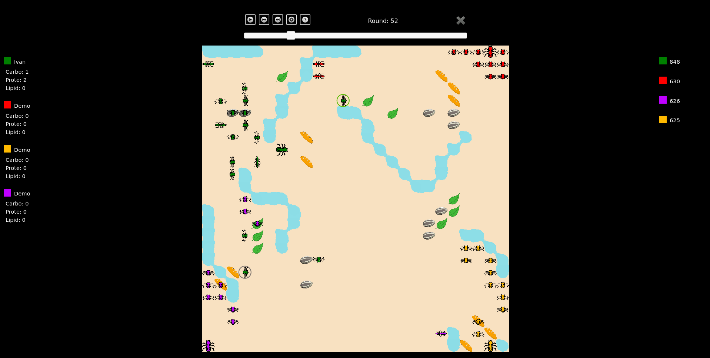

<br/>
<p align="center">
  <h3 align="center">Ants - A game contest</h3>

  <p align="center">
    A coding game contest among all the students!
<br>(c) Universitat Politècnica de Catalunya, 2019
    <br/>
    <br/>
  </p>
</p>


## Table Of Contents

* [About the Project](#about-the-project)
* [Built With](#built-with)
* [Getting Started](#getting-started)
  * [Prerequisites](#prerequisites)
  * [Installation](#installation)
* [Usage](#usage)
* [Authors](#authors)
* [Acknowledgements](#acknowledgements)

## About The Project



This repository contains the complete code needed in order to execute the game made by Data Structures and Algorithmics' professors at the FIB(April 2021). 

The game consisted in a tournament as set of rounds, in each of which four students faced off. The winning student would advance to the next round until reaching the final rounds and becoming the winner.

Specifically, every round winner was decided by putting each student's ant colony to battle against three other colonies. The ants had to eat to reproduce and, strategically, consume enemy ants to earn points and survive until the end of the game. Actions of eating and reproducing earned points, and the player with the most points was the winner. 

Each student had to code their own behaviour of the ant colony. This coding game featured the use of graph algorithms, used by the ants to find and go for food or enemies.

_For detailed information about the heading, please see [ants.pdf](https://github.com/ivan-risueno/FIB-EDA_Game-2021Q2/blob/main/ants.pdf)._

## Built With

Each student's code is made entirely in C++, but there are some files written in Javascript or HTML, for example.

## Getting Started

In this section we're covering how to clone the repository and set up the project to be executed.

### Prerequisites

To run this project, no additional packages beyond the basic ones like build-essentials are required. It is optional but recommended to have a web browser to open an HTML file in order to visualize the games.

### Installation

1. Clone the repo:

```sh
https://github.com/ivan-risueno/FIB-EDA_Game-2021Q2
```

2. Inside the root directory, you will need the Dummy AI. In order to use it, you will need to copy any of the existent AIs depending on your OS and architecture. For instance, if you are running a Linux64 machine, run the following commnad(there also exists Dummy AIs for _Linux32_, _MacOS_, _Windows x64_ and _Windows x86_):

```sh
cp AIDummy.o.Linux64 AIDummy.o
```

3. Compile the game. It can be done with the command

```sh
make all
```

For further information about the compilation check the [Makefile](https://github.com/ivan-risueno/FIB-EDA_Game-2021Q2/blob/main/Makefile).

## Usage

In order to execute the game, you will need to run the following command:

```sh
./Game P1 P2 P3 P4 -s randomSeed -i default.cnf -o outputFile
```

where _PN_ are the players, _randomSeed_ consists of an integer meaning a random seed used for random aspects of the game and _outputFile_ is the output file of the execution, needed to visualize the match. 

For example, if you want to run the game using my AI and three other AIs made by the professors, just run:

```sh
./Game Ivan Dummy Dummy Dummy -s 90 -i default.cnf -o default.out
```

To see a list of diferent options and parameters for the execution, run:

```sh
./Game --help
```

As mentioned before, you can also visualize a recent execution. Just open the [viewer](https://github.com/ivan-risueno/FIB-EDA_Game-2021Q2/blob/main/Viewer/viewer.html) with a browser, and open the .out file generated with that execution.


### Creating A Pull Request


## Authors

* **ivan-risueno** - *By the time this game contest was active, I were in second year of university, yet learning how to code.* - [ivan-risueno](https://github.com/ivan-risueno/) - *[AIIvan.cc file](https://github.com/ivan-risueno/FIB-EDA_Game-2021Q2/blob/main/AIIvan.cc)*

## Acknowledgements

* [Enric Rodríguez](https://futur.upc.edu/EnricRodriguezCarbonell/o/YWN0aXZpdHlfY2FfdGl0bGVfc29ydCBhc2M=)
